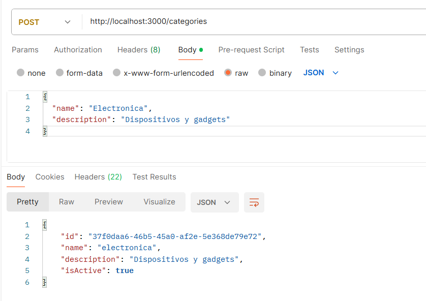
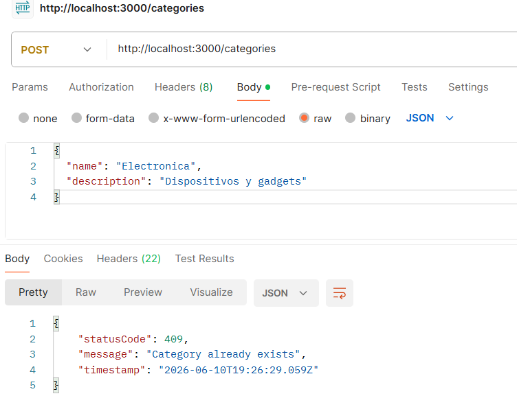
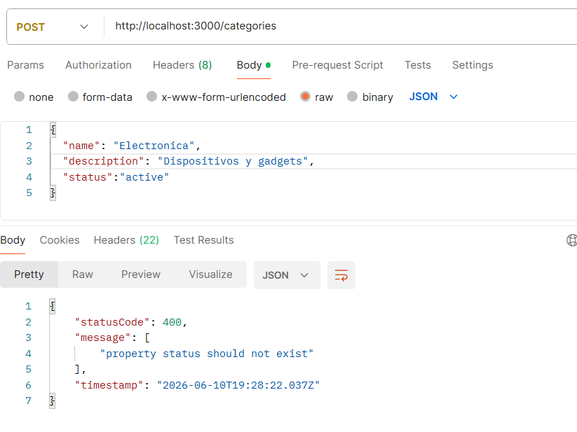
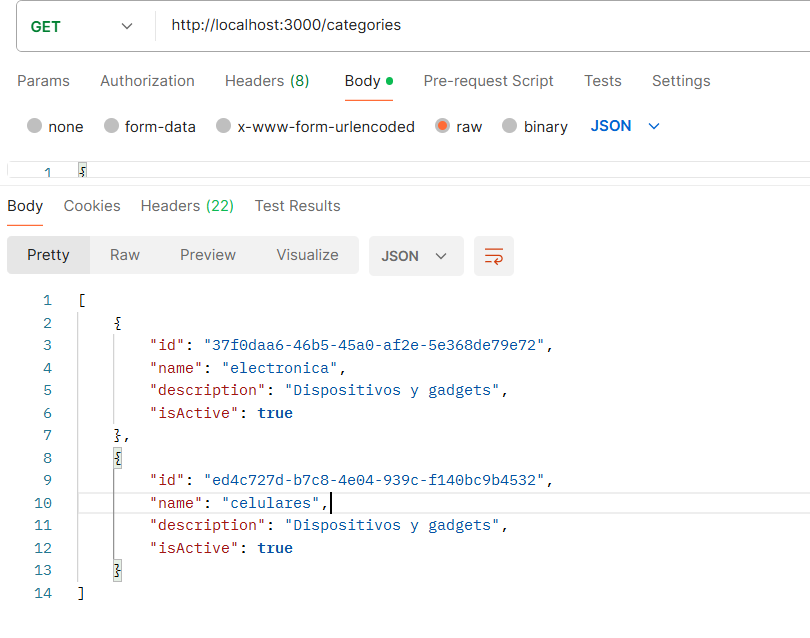
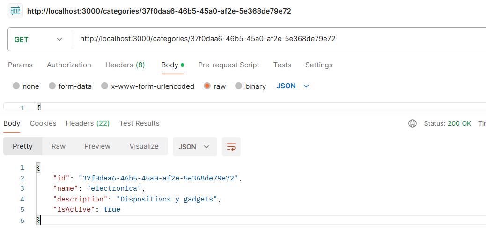
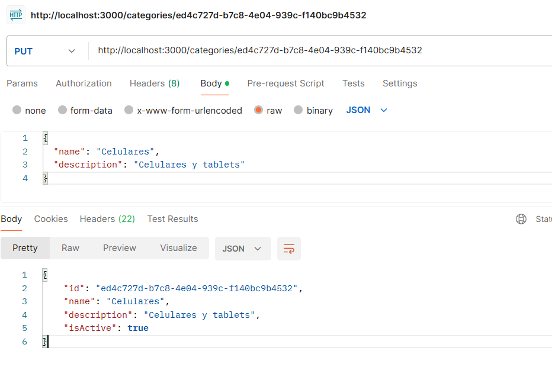
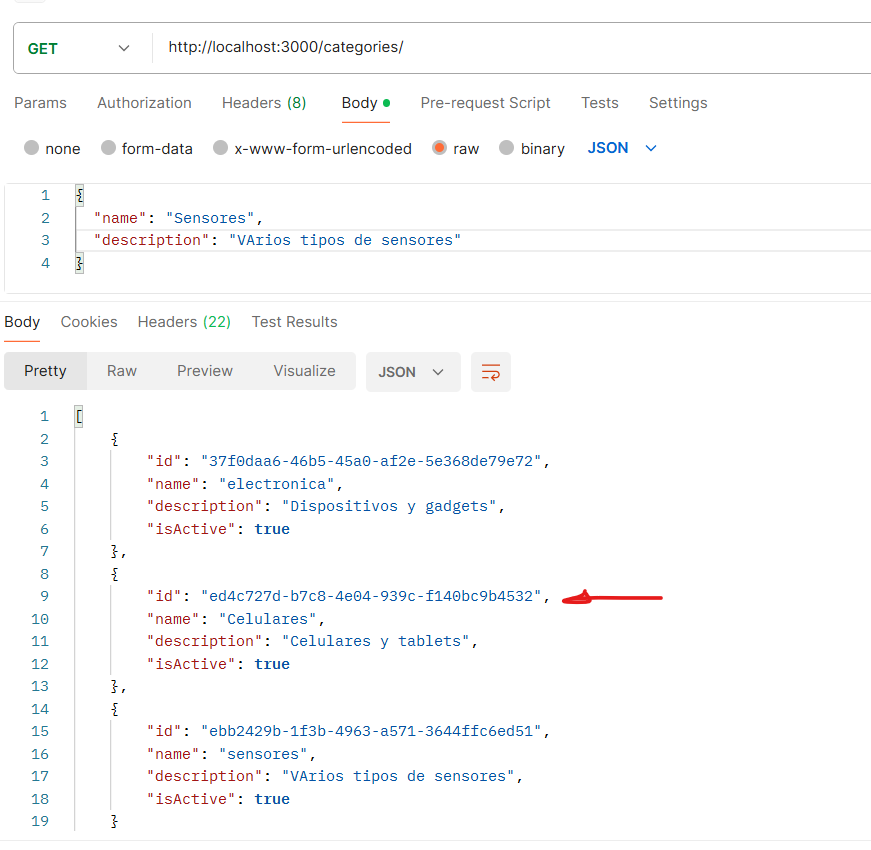
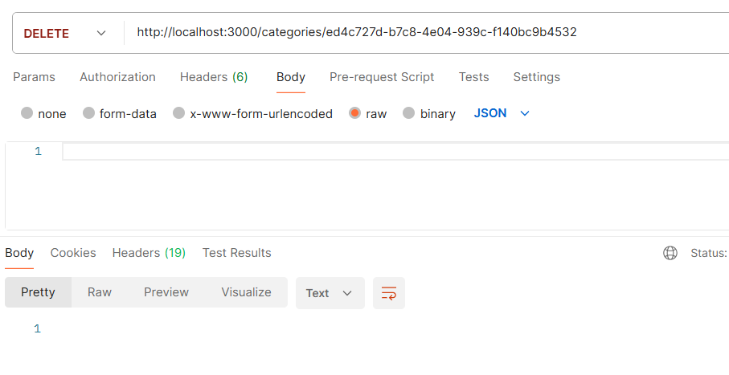
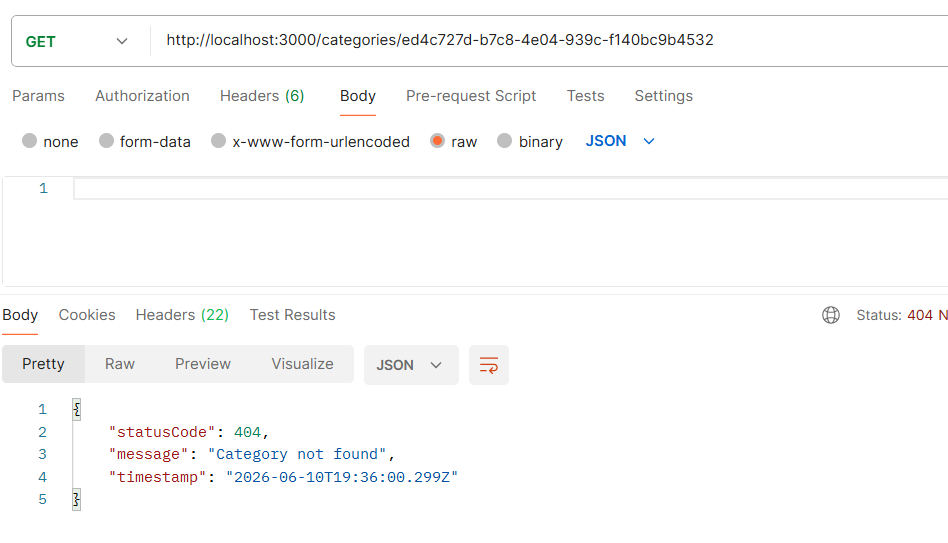

# Instrucciones

Como requisito previo es necesario tener creada una base de datos en **PostgreSQL**.

## Clonar el proyecto

1. Clonar el proyecto
```bash
git clone https://github.com/agcudco/productos-categorias-espam.git
```

2. Instalar las dependencias
```bash
npm install
```
3. Crear el `.env` en la raíz del proyecto.

El archivo debe contener las siguientes variables:

```bash
DATABASE_HOST=localhost
DATABASE_PORT=5432
DATABASE_USER=postgres
DATABASE_PASSWORD=password
DATABASE_NAME=products
```

4. Ejecutar el proyecto
```bash
npm run start:dev
```

## Probar los endpoints

| Método | Endpoint              | Descripción                          | JSON de entrada / Parámetros                                                                                 |
|--------|-----------------------|--------------------------------------|--------------------------------------------------------------------------------------------------------------|
| POST   | /categories           | Crear una nueva categoría            | `json { "name": "Electrónicos", "description": "Dispositivos y gadgets" }`                                   |
| GET    | /categories           | Listar todas las categorías          | -                                                                                                            |
| GET    | /categories/:id       | Obtener una categoría por ID         | `:id` = UUID de la categoría                                                                                 |
| PUT    | /categories/:id       | Actualizar una categoría existente   | `json { "name": "Electrónica", "description": "Productos electrónicos actualizados" }` (campos opcionales)   |
| DELETE | /categories/:id       | Eliminar una categoría por ID        | -                                                                                                            |

## Ejemplos
Inserción de una nueva categoría


Intento de registrar una categoría existente


Validación de campos inexistentes en el DTO


Listar todas las categorías


Listar una categoría por ID


Actualizar una categoría


Eliminar una categoría

1. Seleccionar la categoría a eliminar


2. Eliminar la categoría


3. Verificar que la categoría ha sido eliminada
